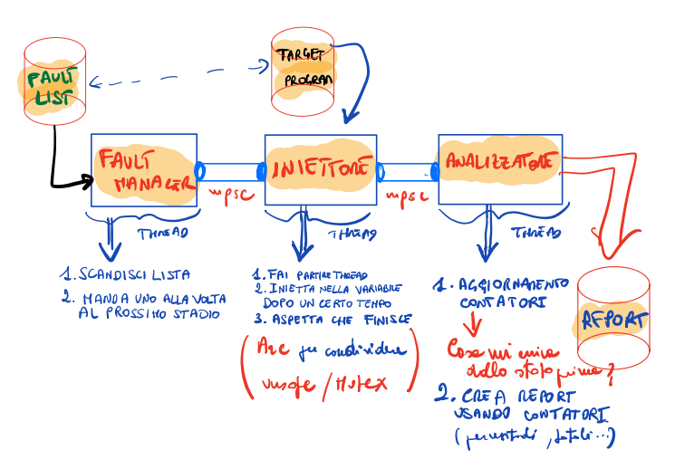

# ProgettoPdS::prj_G19
#### Realizzazione di un ambiente di Fault Injection per applicazione ridondata

[Traccia del progetto](https://github.com/cmigliaccio00/ProgettoPdS_materiale)

>**<u>CONSIGLIO 0</u>** Prima di fare qualsiasi modifica al progetto presente in questa cartella, ricordarsi di fare `git pull` per evitare spiacevoli inconvenienti che portano a perdita di tempo e salute.


### Consigli:
- Leggere i paper indicati con `(todo)` nella traccia del progetto (vedi link sopra)
- Leggere le slide relative a _Moduli e test_: può essere utile soprattutto a livello di "SoftEng".
<hr style="border: 0.5px solid red">

## Casi di studio
Dopo un'indagine, e volendo mantenere una certa coerenza con il lavoro già fatto da altri nelle pubblicazioni scientifiche di cui sopra, si è giunti a una sorta di compromesso, decidendo di prendere in esame:
1. **Bubble sort** o **Selection Sort** (Algoritmo di ordinamento), da scegliere uno dei due in base ai risultati prodotti;
2. **Moltiplicazioni tra due matrici** 5x5 (Algoritmo classico usato in una varietà cospicua di contesti).

## Prima Parte (Mattia)
E' la parte che riguarda l'irrobustimento del codice e l'utilizzo del tipo `Hardened` modificandone/migliorandone l'implementazione se necessario, partendo da quella già presente nel modulo `hardened`. Un commento più approfondito viene riportato di seguito.

**Task da svolgere (orientativamente parlando...)**:
1. Reperire il codice per gli algoritmi citati, scriverli in Rust e verificarne la correttezza logica e sintattica con qualche test/esempio che li utilizzi (Selection Sort già c'è con i relativi test d'unità funzionanti); in questo modo si ha la certezza di andare avanti con un livello di astrazione diverso partendo da una base corretta; inoltre queste funzioni sono input fondamentale per il primo stage della seconda parte per la generazione della fault-list: si usa il codice non irrobustito per effettuare un'analisi statica ed estrarne informazioni, questo non è altro che una fase preparatoria alla creazione della fault-list.
2. Riscrivere/Adattare l'algoritmo proposto con i tipi `Hardened<T>` (per 
   dettagli 
   ulteriori vedi video relativo sulla cartella condivisa di Google Drive).
   - Nota che: in questa fase ci potrebbe essere la necessità di dover implementare tratti mancanti nell'implementazione attuale. 
   - Ad esempio: 
      per la _moltiplicazione di matrici_ bisogna fare operazioni del tipo `acc += r_el*c_el` dove `acc` è un accumulatore e `r_el`, `c_el` sono l'elemento corrispondente di riga e colonna della matrice; tutte queste variabili per gli scopi del progetto sono di tipo Hardened. I tratti `Mul` e `AddAssign`, per eseguire rispettivamente `*` e `+=`, non sono implementati. Bisogna quindi che vengano implementati prima di poter scrivere il codice che li utilizzi, diversamente il compilatore genererà un errore relativo al fatto che per quel tipo non ci sono certi tratti. Quello che ci siamo detti fino a questo punto.
3. Testare tramite qualche esempio che le cose vadano come ci si aspetta (eg. Controllo di correttezza dell'output...). [Volendo, in base al tempo disponibile,  si potrebbero anche  scrivere dei test d'unità per gli algoritmi implementati secondo il paradigma AAA]. 

> **Nota aggiuntiva** Nell'implementazione delle feature mancanti del tipo `Hardened` vanno gestiti e fatti sempre i controlli di consistenza sulle parti in cui è necessario (ricorda dalle "regole d'oro": ogni lettura di una qualsiasi variabile deve essere sempre preceduto da un controllo di consistenza). In particolare:
>  - Se la firma del metodo di un certo tratto ha un tipo associato `type Output` allora posso ritornare un `Result<Hardened<T>,IncoherenceError>`;
>  - Altrimenti devo ritornare un `panic!(...)` prendendo come spunto quello che si è già fatto o cambiandolo se si crede che si possa fare meglio  e diversamente.

### Esempi, ulteriori chiarimenti

#### Gestione delle matrici
Uno dei nostri casi di studio riguarda la moltiplicazione tra matrici. Uno dei modi per utilizzare in Rust la notazione C-like `mat[i][j]` è quello di definire un dato di tipo
```rust
let mut matrix: = Vec::new();
 ```
Quindi ci si basa in questo caso sull'utilizzo di un vettore di vettori. Ogni vettore è una riga della matrice.
Di seguito un esempio che fa utilizzo di matrici definite in questo modo. In generale sono pochi gli accorgimenti da avere rispetto ad un algoritmo scritto in C base.

```rust
#[allow(non_snake_case)]
fn main(){
    //Dichiarazione ex-novo della matrice come Vec<Vec<T>>: 
    //il costruttore e' sempre quello di base
    let mut matrix = Vec::new(); 

    //Dichiarazione tramite macro vec![]
    let mat1 = vec![vec![3,2,1], 
                    vec![2,1,2], 
                    vec![1,2,1]];
    let _nR = mat1.len(); 
    let _nC = mat1[0].len();
    matrix = mat1; 
    //Scansione della matrice
    for i in 0.._nR{
        for j in 0.._nC{
            print!("mat[{}][{}]: {} ", i, j, matrix[i][j])
        }
        println!(" ");
    }
    println!(" ");
    //Esempio di modifica: trasformo la matrice in identità
    for i in 0.._nR{
        for j in 0.._nC{
            if i==j {matrix[i][j]=1}
            else{matrix[i][j]=0}
        }
    }
    print_matrix(&matrix,_nR,_nC);
}
fn print_matrix(mat: &Vec<Vec<i32>>, nR: usize, nC: usize){
    for i in 0..nR{
        for j in 0..nC{
            print!("{} ", mat[i][j]);
        }
        println!(" ");
    }
}
```

#### Codice non irrobustito 
Questa/Queste funzioni verranno utilizzate come input per effettuare l'analisi statica del codice (parte di Carlo) per ricavare le informazioni circa:
+ Numero totale di istruzioni
+ Nome, tipo, dimensione delle variabili

>A questo scopo, è stato implementato un sottomodulo che si occupa solo di questo (`fault_list_manager/static_analysis`) che utilizza la libreria `syn`, la quale a sua volta implementa un parser che permette di analizzare dei syntax tree associati a codice. Poiché il codice che può essere implementato è molto vario, la funzione che è stata scritta per analizzarlo effettua tutti i controlli di base per estrarre tipi, effettuare conteggi, estrarre dimensioni in presenza di flusso sequenziale o condizionato(if/while...). Per questo motivo ci sono degli accorgimenti da tener presente nel momento in cui si scrive il codice delle funzioni (non irrobustite). Vengono riportati di seguito.

1. Le istruzioni di dichiarazione con annessa assegnazione al quale viene assegnato direttamente un valore non hanno bisogno di avere specificato esplicitamente il tipo 
```rust
let mut a=5;    /*1*/             let mut a:i64 = 5; /*2*/        
```
La sintassi dell'istruzione 2 deve essere utilizzata solo nel caso in cui si voglia esplicitamente usare il tipo `i64`, altrimenti per default viene assegnato un `i32`.
2. Le istruzioni di dichiarazione (let) il cui valore assegnato viene ricavato da un'ulteriore elaborazione (valore di altra variabile, valore restituito da una funzione, risultato di un'operazione aritmetica). Esempio:
```rust
   let a=1; 
   let b=5; 
   let c:i32 = a+b;   
```
Se scrivessi al posto di `let c:i32=a+b`, l'istruzione `let c=a+b`, questa non verrebbe ben interpretata, in particolare il tipo non viene inferito correttamente (per semplicità non si è introdotto questo tipo di dettaglio nell'implementazione del codice che se ne occupa).

Per concludere questa parte, si da un esempio di codice non irrobustito con la controparte che usa il tipo `Hardened`.

#### Funzione `selection_sort()` (senza redundancy)
```rust
   fn selection_sort(vet: Vec<i32>){
    let mut N = vet.len();
    let mut j=0;
    let mut min=0;

    //-----------------------SELECTION SORT-------------------------
    let mut i=0;
    while i<N-1{
        min=i;
        j=i+1;
        //Ricerca del minimo
        while j<N{
            if Vec[j] < Vec[min]{   Pos=j;  }
            j = j+1;
        }
        //Scambio il minimo
        vet.swap(min,i);
        //Vado avanti
        i=i+1;
    }
}
```

#### Funzione `selection_sort()` (con uso di `Hardened`)
```rust
fn selection_sort(vet: &mut Vec<Hardened<i32>>)->Result<(), IncoherenceError>{
    let mut N:Hardened<usize> = vet.len().into();
    let mut j= Hardened::from(0);
    let mut min = Hardened::from(0);
    //--------------SELECTION SORT-------------------------
    let mut i= Hardened::from(0);
    while i<(N-1)?{
        min.assign(i)?;                 //min=i
        j.assign((i+1)?)?;        //j=0
        //Ricerca del minimo
        while j<N{
            if vet[j]<vet[min]  {   min.assign(j)?; }
            j.assign((j+1)?)?;
        }
        //Scambio il minimo
        vet.swap(i.inner()?, min.inner()?);
        //Vado avanti
        i.assign((i+1)?)?;
    }
    //------------------------------------------------------
    Ok(())
}
```

> Può essere utile dare uno sguardo attento al codice di entrambe le funzioni per confrontare e trovare collocazione di tutti gli accorgimenti fatti in precedenza.


## Seconda Parte 
Questa parte è relativa allo sviluppo dell'ambiente di Fault Injection che prende come programmi attaccati (target) quelli implementati nella fase precedente.
Si è pensato di implementare questa seconda parte realizzando una sorta di pipeline combinando l'utilizzo di thread e canali di tipo 'multiple producer single consumer (mpsc)'.

>In questa parte non serve aver già pronti i casi di studio e l'analizzatore per poter andare avanti con le due parti centrali (Fault Manager e  Iniettore). Si può utilizzare invece come "benchmark" il caso di studio già implementato del __Selection Sort__.

### Implementazione della pipeline


La pipeline che implementa tutta la seconda parte del progetto è composta da tanti stadi quante sono le fasi di analisi: 
1. Fault Manager
2. Iniettore
3. Analizzatore

Questi fanno utilizzo di alcune fonti (indicate nello schema con dei cilindri):
1. La **fault list** (per ogni caso di studio): precedentemente generata e    serializzata.
2. Il **programma target** (caso di studio) utilizzato sia in fase di    iniezione che in fase di generazione della lista di guasti per l'analisi    statica del codice.
3. Il **report** che potrebbe essere salvato (volendo) su un file di testo    oltre che a essere visualizzato (CLI, GUI o altro).

Un'idea sarebbe quella di realizzare questa pipeline all'interno di una funzione wrapper fatta in questo modo o in un modo simile:

```rust
use std::sync::mpsc::channel;

fn fault_injection_env(fault_list: String,      //nome file fault-list
                       target: String,          //nome programma target
                       report_name: String) {   //nome file report
   let (tx_chan_fm_inj, rx_chan_fm_inj) = channel();
   let (tx_chan_inj_anl, rx_chan_inj_anl) = channel(); 
   
   //Questi possono essere a loro volta wrapper che faranno delle cose
   FaultManager(tx_chan_fm_inj,fault_list);
   Iniettore(rx_chan_fm_inj, tx_chan_inj_anl, target); 
   Analizzatore(rx_chan_inj_anl);
}
```

### Fault List e Fault manager (Carlo)
**Task da svolgere (orientativamente parlando...)**:
1. **Lista dei guasti**:
   1. Analisi statica di ogni caso di studio usando eventualmente `clippy`, `rust-analyzer`, `syn`. Di particolare interesse sono: nome della variabile, dimensione della variabile, numero di righe di codice di cui è costituito il programma (caso di studio).
   2. Sulla base delle informazioni generare un certo numero di entry fatte da `<variabile, tempo_iniezione, fault_mask>`
   3. Si potrebbe pensare di serializzare le informazioni su un file utilizzando il crate `serde`, chiaramente questo prevede che venga creato un tipo nuovo. Ad esempio:
   ```rust
    struct FaultListEntry{
        var: String,
        time: usize, 
        fault_mask: u64
    }
    ```
   A questa bisogna far implementare (tramite `derive`) i tratti `Serialize` e `Deserialize`. (Si potrebbe pensare alla generazione della lista di guasti come una funzionalità del programma, poiché c'è un pezzo di codice che fa questo 'mestiere').
2. **Fault List Manager**:
   1. Deserializzare la lista dei guasti all'interno di una opportuna collezione;
   2. Ogni guasto deve essere mandato tramite l'opportuno `Sender` attraverso il canale che lo porta verso l'iniettore (stage della pipeline successivo).
   3. Una volta terminate le entry si può distruggere l'estremità 'TX' del canale che collega i primi due stadi, in modo che l'iniettore non resti in attesa all'infinito.

### Iniettore (Alessandro)
E' la parte centrale della pipeline che si occupa di iniettare nelle variabili ai tempi di iniezione stabiliti. Potrebbe essere utile in fase di presentazione del progetto chiarire tra le tante tecniche di _Software Fault-Injection_ disponibili quale è stata implementata. Il nostro caso si potrebbe riportare al caso di **Runtime injection** di tipo _Exception/trap_ (dall'articolo di riferimento) si cita:

>_Exception/trap._ In this case, a hardware exception or a software trap transfer control to the fault injector. Unlike time-out, exception/trap can inject the fault henever certain events or conditions occur. For example, a software trap instruction inserted into a target program will invoke the fault injection before the program xecutes a particular instruction. When the trap executes, an interrupt is generated that transfers control to an interrupt handler. (...)

**Task da svolgere (orientativamente parlando...)**:
1. **Prelievo del guasto**, tramite l'opportuno `Receiver` (dal canale che    collega primo e secondo stadio), chi realizza lo stage prima (Carlo) deve    comunicare ome minimo come è fatto il tipo associato alla 'fault-entry' e    qualche    metodo al fine di    poterlo utilizzare correttamente.
2. **Avvio del task e iniezione del guasto**: si fa partire il thread e al    momento opportuno viene iniettato il guasto.
3. **Aspetto la terminazione**: ci si arresta sulla `JoinHandle`, invocando poi   su questa il metodo `join()` che come noto restituisce il Result.
4. **Mandare il risultato** verso l'opportuno `Sender`, descrivere inoltre a    modo di    documentazione qual è il risultato che l'analizzatore dovrà aspettarsi in    ottica di poter avere un 'manuale' con cui poter utilizzare queste    informazioni ai fini dell'analisi.

#### Aspetti pratici/realizzativi (spunti)
1. **Condivisione delle informazioni tra thread**
   1. Per la condivisione di variabili tra thread diversi vanno senza dubbio       utilizzati smart pointer di tipo `Arc`;
   2. Occorre dare possibilità alla coppia di thread iniettore-iniettato di       modificare le variabili. A questo punto le strade che si possono       utilizzare sono due: utilizzo di blocchi `unsafe`, utilizzo di `Mutex`       per accedere ai dati in maniera controllata.
   3. Si dovrebbe in qualche modo trasformare la stringa proveniente dalla       fault-entry in una variabile da utilizzare, ci dovrebbero essere in       rust delle macro o funzioni che mi permettono di fare una sorta di  `eval` di un'espressione.
2. **Temporizzazione tra thread iniettato e thread iniettore**
   1. A questo scopo si possono utilizzare i channel. Prendendo ispirazione       dal paper che utilizza il tracing per far partire l'injection a un       certo istante, si potrebbe far seguire ogni istruzione del caso di       studio analizzato da una `send()`       fatta all'interno di un canale creato tra i due thread. 
   2. Il thread       iniettore resta in ascolto di questi messaggi e li conta, al momento       opportuno prende il possesso del lock e inietta nelle variabili       utilizzando la fault mask. 

   #### Esempio risultato generato da analisi
   ```JSON
      {
         "num_inst": 13,
         "vars": [
         {
            "name": "vet",
            "ty": "Vec < i32 >",
            "size": "4*len",
            "start": 1
         },
         {
            "name": "i",
            "ty": "i32",
            "size": "4",
            "start": 4
         },
         {
            "name": "min",
            "ty": "i32",
            "size": "4",
            "start": 3
         },
         {
            "name": "N",
            "ty": "usize",
            "size": "4",
            "start": 1
         },
         {
            "name": "j",
            "ty": "i32",
            "size": "4",
            "start": 2
         }
      ]
   }
   ```

   __Nota che:__ per questa parte quello che interessa a chi implementa l'iniettore è solo l'informazione sul conteggio delle informazioni, in quanto tutte le altre informazioni provengono dallo stage precedente tramite le entry della fault list.
   C'è un unico accorgimento da tenere in considerazione: le istruzioni contenute nei cicli vengono contate una sola volta per cui in ottica di aggiornare correttamente il conteggio e di "innescare" nei punti giusti i fault, potrebbe aver senso decrementare il conteggio all'uscita dal ciclo di un numero di istruzioni pari a quelle contenute nel ciclo.

   > Di seguito è riportato il codice originale commentato con il conteggio delle istruzioni, che mostra come e quali sono le istruzioni che vengono contato dalle funzioni contenute nel sottomodulo di `static_analysis`

   ```rust
      fn selection_sort(vet: Vec<i32>){
         let mut N = vet.len();           //1
         let mut j=0;                     //2
         let mut min=0;                   //3
         let mut i=0;                     //4
         while i<N-1{                     //5
            min=i;                        //6
            j=i+1;                        //7
            while j<N{                    //8
                  if Vec[j] < Vec[min]{   //9
                     Pos=j;               //10
                  }
                  j = j+1;                //11
            }
            vet.swap(min,i);             //12
            i=i+1;                       //13
         }
      }
   ```

### Analizzatore (Federico)
Quest'ultima fase è quella in cui si **raccolgono** e **analizzano** tramite tabulati, indici di tendenza centrale, indici di dispersione... i dati ottenuti dalle imulazioni effettuate agli stage precedenti.

**Task da svolgere (orientativamente parlando...)**:
1. Per ogni elemento prelevato tramite un opportuno Receiver (del canale che    collega Iniettore e Analizzatore) si tengono aggiornati i contatori di (a    titolo di sempio):
   1. _Fault silent_
   2. _Errori rilevati tramite panic/IncoherenceError_    Per questa parte si utilizzano le informazioni provenienti da chi       sviluppa lo stage di prima (Ale).
2. Per la presentazione dei risultati ci si può ispirare ai paper di    riferimento sia della prima che della seconda parte. In particolare    [questo articolo](https://github.com/cmigliaccio00/ProgettoPdS_materiale/blob/main/paper/SecondPart/1.pdf)

> Potrebbero essere interessanti queste fonti: 
- https://docs.rs/plotters/latest/plotters/#demo-projects in cui
- https://crates.io/crates/plotlib/

Sono due crate che permettono di creare grafici (magari può essere uno strumento per la presentazione dei risultati). 

## Questioni ancora aperte
- Come interagisce un utente di questo programma con l'applicazione?   (esempio: CLI, GUI...) se abbiamo tempo sarebbe carino creare   un'interfaccia grafica semplice on pochissime funzioni essenziali e per   la visualizzazione dei risultati ottenuti.
- Varie ed eventuali... (modificate voi all'occorrenza questa parte)

# Consegna e Presentazione del progetto 
Almeno 3 giorni prima dell'appello bisogna:
1) Caricare il progetto su git;
2) Mandare una mail a entrambi i docenti per dire che il progetto è stato 
terminato;
3) Iscriversi all'appello (entro le scadenze)

### Materiale per la consegna e/o presentazione
- Manuale di sviluppo: strutture dati/costrutti utilizzati con motivazione 
  (da consegnare)
- Manuale utente: come utilizzare il software? (da consegnare)
- Presentazione: cosa è stato fatto tecnicamente (?) 